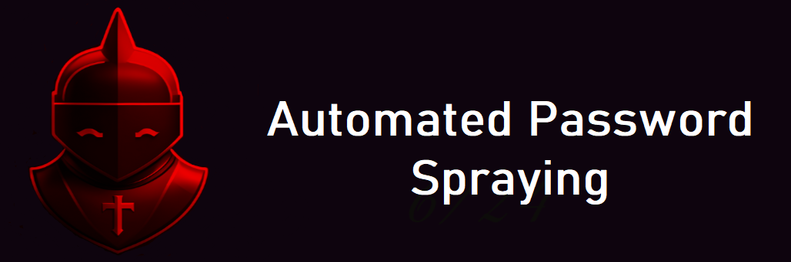

# Automated CME Password Spraying




## Overview

Automated CME Password Spraying is a Python script designed for efficient and targeted password spraying attacks using CrackMapExec (CME). It allows to automate the process of testing a list of passwords against a large number of users in a Windows Active Directory environment. After the Threshold is reached, a Reset Account Lockout counter is started. When this timer expires, the script continues. This script is intended for legitimate testing purposes only and should not be used for any illegal activities or unauthorized access.

## Features

- Password spraying against user accounts in a Windows Active Directory.
- Efficient use of CrackMapExec for password spraying attacks.
- Automated handling of user and password lists.
- Adjustable Lockout Threshold and Lockout Reset Timer.
- Clear reporting of successful password matches.

## Prerequisites

- Python 3.6 or higher
- CrackMapExec tool installed

## Usage

1. Clone this repository: `git clone https://github.com/GabrielDuschl/Automated-CME-Password-Spraying.git`
2. Navigate to the repository: `cd Automated-CME-Password-Spraying`
3. Set it as executable: `chmod +x CME-Password-Spraying.py`
4. Run the script: `python3 CME-Password-Spraying.py`

## Configuration

- `--user` or `-u`: File containing user IDs.
- `--password` or `-p`: File containing passwords to be tested.
- `--threshold` or `-t`: Account Lockout Threshold (default: 5).
- `--lockout` or `-l`: Reset Account Lockout Counter in minutes (default: 15).
- `--domain` or `-d`: Domain name for testing.
- `--pass-length` or `-pl`: Minimum password length.

## Example

```shell
python3 CME-Password-Spraying.py -u users.txt -p passwords.txt -t 3 -l 10 -d example.com -pl 8
```

## License

This project is licensed under the MIT License. See [LICENSE](LICENSE) file for details.

## Contact

For any questions or feedback, feel free to reach out:

- LinkedIn: [Gabriel Duschl](https://www.linkedin.com/in/gabrielduschl)
